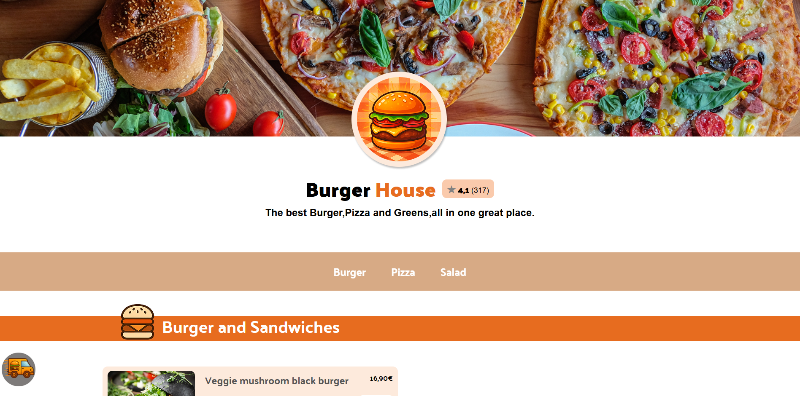

# 🍔 Burger House – Moderne Food Ordering Web App

Eine responsive Food-Ordering-Webseite mit dynamischem Warenkorb, Local Storage und interaktiver Benutzeroberfläche – inspiriert von Lieferdiensten.

---

## 🚀 Live Demo

👉 https://ismael993-create.github.io/Bestellapp/

---

## 📸 Preview

---

## 🧩 Projektbeschreibung

**Burger House** ist eine moderne, responsive Food-Ordering-Webanwendung mit Fokus auf Benutzerfreundlichkeit und dynamischer Interaktion.

Die Plattform bietet:

Eine visuelle Startseite mit Kategorien wie Burger, Pizza und Salate

Einen interaktiven Warenkorb

Dynamisches Rendering aller Inhalte

Persistente Speicherung über Local Storage

Eine Benutzeroberfläche ähnlich bekannten Lieferdiensten

Das Projekt kombiniert strukturiertes HTML, modernes CSS und funktionales JavaScript zu einer realistischen Web-App.

---

## ✨ Features

🍔 **Menü & Kategorien**
Darstellung verschiedener Essenskategorien (Burger, Pizza, Salate)
Übersichtliche Struktur und Navigation
Visuell ansprechende Darstellung

🛒 **Warenkorb-System**
Hinzufügen und Entfernen von Produkten
Dynamische Preisberechnung
Anzeige aller ausgewählten Items

🔄 **Dynamisches Rendering**
Zentrale Renderfunktion zur Aktualisierung der UI
Echtzeit-Updates bei Nutzerinteraktionen
Effiziente DOM-Manipulation

💾 **Local Storage**
Speicherung des Warenkorbs im Browser
Daten bleiben auch nach dem Neuladen erhalten
Verbesserte User Experience

⭐ **Bewertungssystem (UI)**
Anzeige von Bewertungen (z. B. 4.1 Sterne)
Realistische Shop-Darstellung

---

## 🛠️ Verwendete Technologien

HTML5 (semantische Struktur)

CSS3 (Flexbox, Grid, Responsive Design)

Vanilla JavaScript

Local Storage API

Dynamische Renderfunktion

---

## ⚙️ JavaScript-Funktionalität

**Renderfunktion**
Zentrale Steuerung der UI
Aktualisiert Menü, Warenkorb und Preise dynamisch

**Warenkorb-Logik**
Produkte hinzufügen / entfernen
Mengenverwaltung
Preisberechnung in Echtzeit

**Local Storage**
Speichert den aktuellen Warenkorb
Lädt Daten beim Start der Seite automatisch

**DOM-Manipulation**
Dynamisches Erstellen und Aktualisieren von HTML-Inhalten
Interaktive Benutzerführung

---

## 📱 Responsive Verhalten

Desktop: Strukturierte Ansicht mit klarer Menüführung

Tablet: Angepasstes Grid-Layout

Mobile: Optimierte Darstellung für kleine Bildschirme

Flexible Elemente und skalierende Inhalte

---

## 🎯 Lernziele des Projekts

Umsetzung einer realistischen Web-App ohne Frameworks

Arbeiten mit dynamischem Rendering in JavaScript

Verwendung von Local Storage zur Persistenz

Verständnis für Warenkorb-Logik

Verbesserung von DOM-Manipulation

Responsive Webdesign

Saubere Projektstruktur

---

## 🙌 Autor

Erstellt von Ismael

